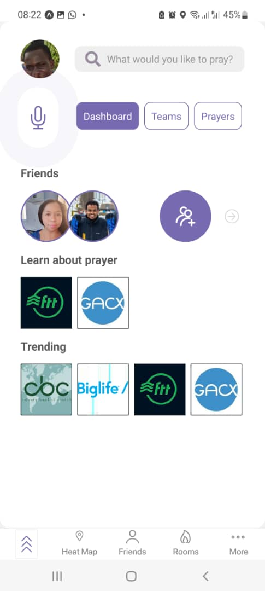
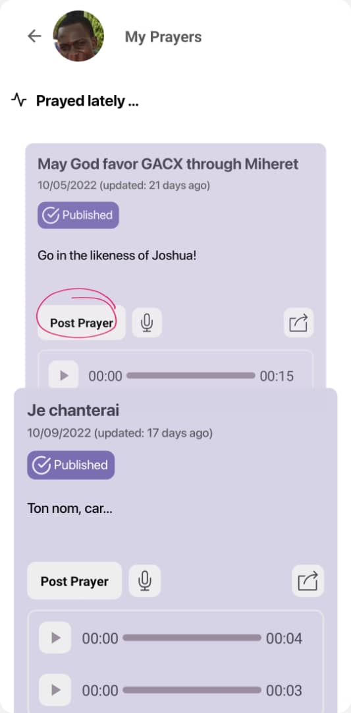
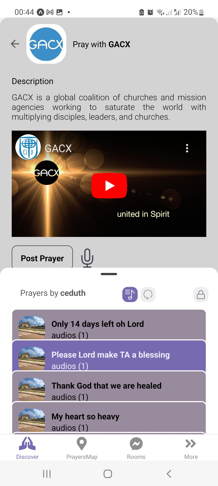

---
# Feel free to add content and custom Front Matter to this file.
# To modify the layout, see https://jekyllrb.com/docs/themes/#overriding-theme-defaults

layout: default
---

**Things Above**&copy; offers prayers and safe online communities to mitigate mental illness challenges and connect those seeking God online. We present an initial mock of the project, destined to materializing Miheret's vision.

## Disclaimer

This project is inspired, ideated and owned by [Miheret Tilahun Estete][miheret-homepage], a Christian minister, Digital Strateist, and Computer Science graduate from Orlando Florida.
Miheret also performs ongoing UX Research and Agile management of all stages of the project,
including Buyer Personae, User Stories, and advocacy to the various stakeholder organizations.
Check the current progress of the project [here][ta-progress-url].

## Context.

Here is the alarming finding striked by Miheret that lead to building Things Above:

> Half of the U.S. between 18–35-year-olds (49%) expressed anxiety over important
> decisions and were afraid to fail. Over a third of the responses said they often felt sad or
> depressed (39%) or lonely and isolated from others (34%) (Barna 2020). This age group
> is the most digitally connected generation and uses digital experiences to build
> meaningful relationships."

## Gallery

<!-- |   |  |  -->

  

[miheret-homepage]: https://www.miheret.com/
[ta-progress-url]: https://jekyllrb.com/docs/home
